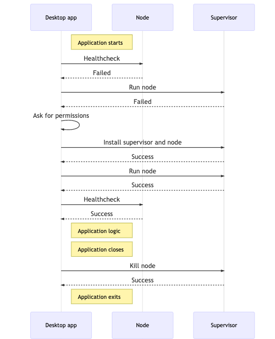
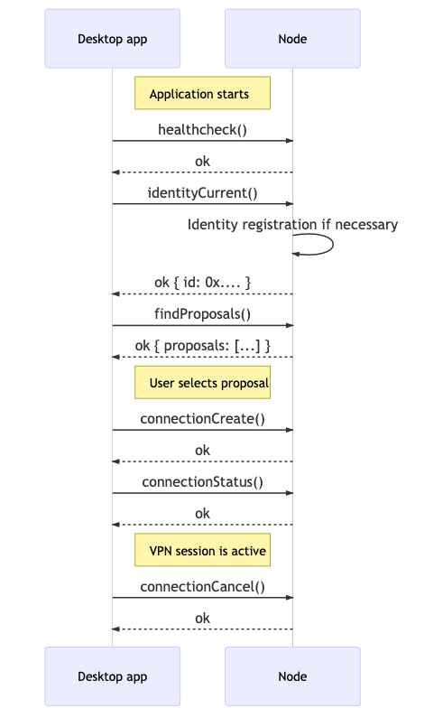

# Developer's guide to Mysterium VPN desktop app

This desktop app is built with:
- Node.js
- Typescript
- [NodeGui](https://github.com/nodegui/nodegui) - Library for native, cross-platform UIs with JS and CSS. Electron-free.
- [node](https://github.com/mysteriumnetwork/node) - Mysterium Node, hereinafter referred to as Node
- [node-supervisor](https://github.com/mysteriumnetwork/node-supervisor) - Supervisor: Background service for installing/running Node
- [mysterium-vpn-js](https://github.com/mysteriumnetwork/mysterium-vpn-js) - JS SDK for communicating with Node

## Supervisor

Supervisor's job is to start Node when necessary and kill it when its job is done. For more information, see its README.

Below is a typical communication sequence on a user system where neither Supervisor nor Node is initially running (clean install).

## Node (Tequilapi)

Desktop app communicates to Node's REST API, _aka_ Tequilapi.  
The easiest way to do that is to use [JS SDK](https://github.com/mysteriumnetwork/mysterium-vpn-js).  
Another possible way is to construct HTTP calls by yourself, consulting [documentation](https://tequilapi.mysterium.network/).  

Below is a typical communication sequence between the App and the Node when establishing a VPN connection.

## Further steps

Fork the repository and start hacking!
